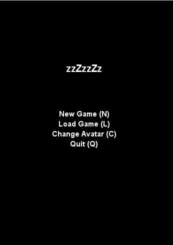
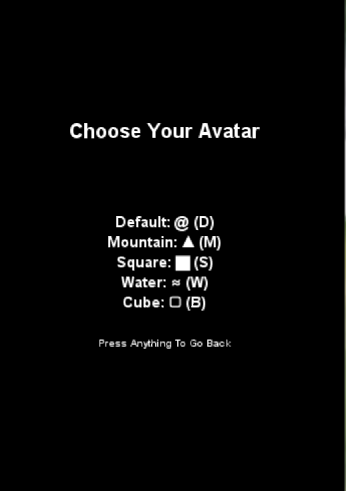
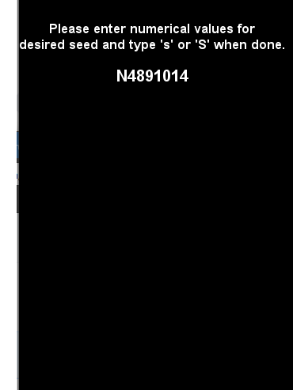
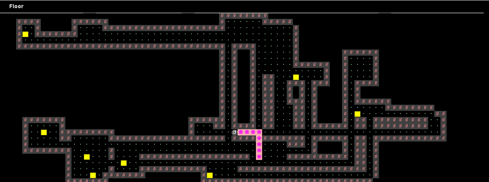

# Introduction
Build Your Own World (BYOW): a pseudorandom 2D world generator with the functionality of players being able to to navigate and interact with the world. The player can choose the seed by entering in a series of numbers along with their avatar icon. This project was a part of my CS 61B, Data Structures, course at UC Berkeley.
The player can create a new world or load an old world if it exists. If the player loads an old world, the world will be in the exact same state as the player previously left it.
# Images
## Menu
The main and avatar icon menus, displaying the available options along with the letter to press on the keyboard that corresponds to each option.

##Other
The player can enter a number for the seed. Since the world is pseudorandomly generated, entering the same seed will return the same world. The player can also see the numbers that they have entered thus far.

This is how the world looks like with the seed 4891014, and after one interaction with the world. The top left world displays the type of tile that the mouse is hovering over. The avatar is the default icon and it has interacted with one of the yellow tiles, which brings the player to a memory game. The game consists of the screen flashing an increasing number of letters that then disappears and the player must recall them correctly. If the player wins x number of rounds, which is shown at the initial launch of the game, then the player will leave behind a pseudorandomly determined tile after every move. 

